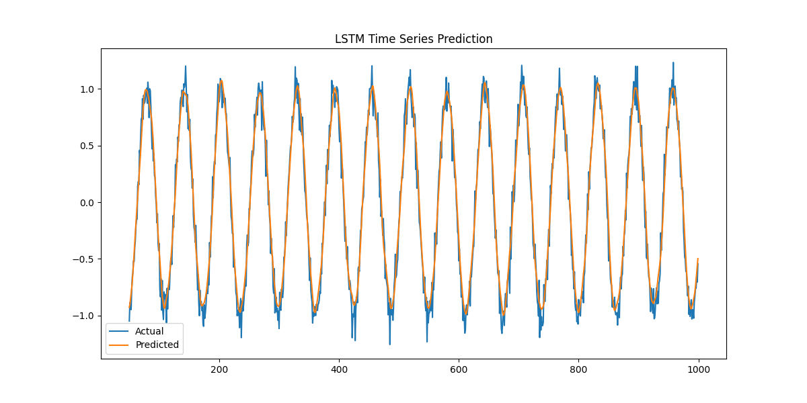
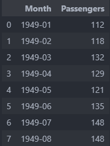
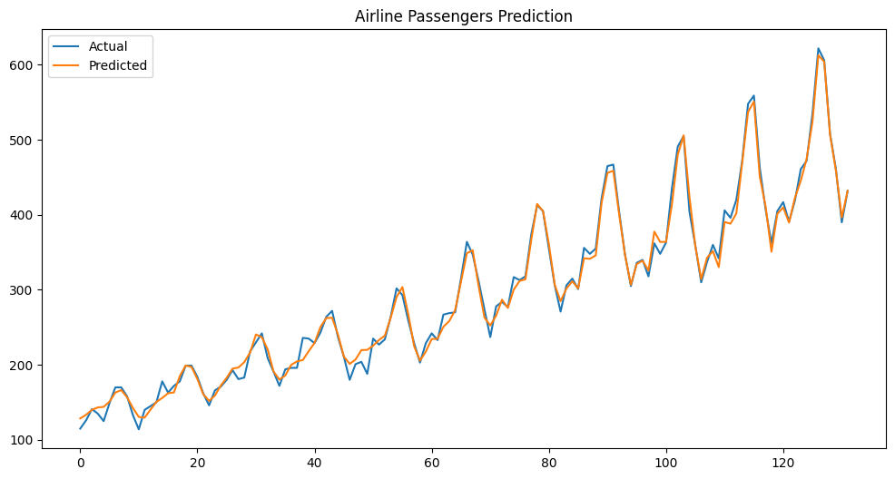

# LSTM-TimeSeries-Predictor
LSTM을 활용한 시계열 예측 문제 해결 프로젝트입니다. 

---
### sin파 예측 문제

```py
data = np.sin(time_steps) + 0.1 * np.random.normal(size=len(time_steps))
```
: sin파형에 노이즈를 추가한 data를 생성

```py
for i in range(len(data) - seq_length):
        X.append(data[i:i+seq_length])
        y.append(data[i+seq_length]) 
```
`X` (`input`) : `i+seq_length` 번째 값을 예측하기 위한한 `i`부터 `i+seq_length-1`까지의 이전 데이터

`y` (`labels`) : `i+seq_length` 예측 정답값

```py
class LSTMModel(nn.Module):
    def __init__(self, input_size, hidden_size, num_layers, output_size):
        super(LSTMModel, self).__init__()
        self.hidden_size = hidden_size
        self.num_layers = num_layers
        self.lstm = nn.LSTM(input_size, hidden_size, num_layers, batch_first=True)
        self.fc = nn.Linear(hidden_size, output_size)

    def forward(self, x):
        h0 = torch.zeros(self.num_layers, x.size(0), self.hidden_size).to(x.device)
        c0 = torch.zeros(self.num_layers, x.size(0), self.hidden_size).to(x.device)
        out, _ = self.lstm(x, (h0, c0))
        out = self.fc(out[:, -1, :])
        return out
```
`num_layers` : RNN 계층 수

#### 하이퍼파라미터 설정
```
sequence_length = 50
batch_size = 32
input_size = 1
hidden_size = 64
num_layers = 2
output_size = 1
learning_rate = 0.001
num_epochs = 20
```

#### 학습 로그 
```
Epoch [1/20], Loss: 0.3337
Epoch [2/20], Loss: 0.0376
Epoch [3/20], Loss: 0.0158
Epoch [4/20], Loss: 0.0138
Epoch [5/20], Loss: 0.0136
Epoch [6/20], Loss: 0.0134
...
Epoch [15/20], Loss: 0.0118
Epoch [16/20], Loss: 0.0121
Epoch [17/20], Loss: 0.0120
Epoch [18/20], Loss: 0.0120
Epoch [19/20], Loss: 0.0117
Epoch [20/20], Loss: 0.0119
```

#### Sin파 예측 결과


---

### Airline Passengers 데이터셋을 이용한 월별 국제 항공 승객 수 예측 문제
```py
url = 'https://raw.githubusercontent.com/jbrownlee/Datasets/master/airline-passengers.csv'
df = pd.read_csv(url, usecols=[1])  # 승객 수 컬럼만 사용
data = df.values.astype('float32')  # NumPy 배열로 변환
```

#### raw data 
: 상위 8개 데이터만 출력하도록 시각화


#### 하이퍼 파라미터
```
seq_length = 12
batch_size = 16
input_size = 1
hidden_size = 50
num_layers = 2
output_size = 1
learning_rate = 0.001
num_epochs = 1000
```

#### 학습 로그
```
Epoch [100/1000], Loss: 0.0029
Epoch [200/1000], Loss: 0.0023
Epoch [300/1000], Loss: 0.0002
Epoch [400/1000], Loss: 0.0029
Epoch [500/1000], Loss: 0.0002
Epoch [600/1000], Loss: 0.0015
Epoch [700/1000], Loss: 0.0004
Epoch [800/1000], Loss: 0.0012
Epoch [900/1000], Loss: 0.0014
Epoch [1000/1000], Loss: 0.0001
```

#### Airline Passengers 예측 결과
